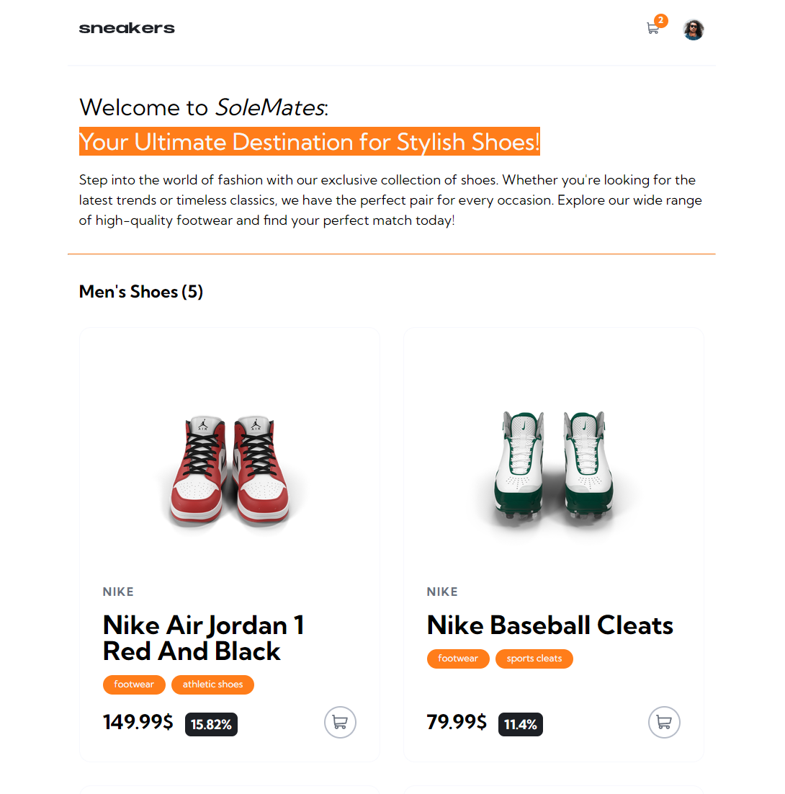

<!-- PROJECT -->

<a id="readme-top"></a>

<div align="center">
 

  <h3 align="center">React Router Ecommerce</h3>

  <p align="center">
    A personal project made starting from a Frontend Mentor exercise during the Frontend - Coding Bootcamp at Edgemony.
  </p>
</div>

<!-- TABLE OF CONTENTS -->
<details>
  <summary>Table of Contents</summary>
  <ol>
    <li>
      <a href="#about-the-project">About The Project</a>
      <ul>
        <li>
            <a href="#built-with">Built With</a>
        </li>
        <li>
            <a href="#key-files-and-directories">Key Files and Directories</a>
        </li>
        <li>
            <a href="#functionality">Functionality</a>
        </li>
        <li>
            <a href="#context">Context</a>
        </li>
        <li>
            <a href="#deployment">Deployment</a>
        </li>
      </ul>
    </li>
    <li>
        <a href="#getting-started">Getting Started</a>
    </li>
    <li>
        <a href="#contacts">Contacts</a>
    </li>
    <li>
        <a href="#license">License</a>
    </li>
    <li>
        <a href="#credits">Credits</a>
    </li>
  </ol>
</details>

<!-- ABOUT THE PROJECT -->

## About The Project

This project is a React-based e-commerce application that allows users to browse products, add them to a cart, and view their cart contents. The application uses React Router for client-side routing and provides a basic layout for product pages, cart pages, and error pages.

### Built With

<div display= "flex">
  
    
    
    

</div>

### Key files and Directories

- `src/App.jsx`: The main application component that renders the entire app.
- `src/providers/CartContext.jsx`: The CartContext provider.
- `src/pages`: Contains page-level components.
  - `[Cart]`: A component that displays the contents of the user's cart.
  - `[ProductPage]`: A component that displays detailed information about a single product.
- `src/components`: Contains reusable components.
  - `[Button]`: A reusable button component.
  - `[Catalog]`: A component that displays a list of products.
  - `[CartItem]`: A component that represents a single item in the cart.
  - `[Counter]`: A component that allows users to increment or decrement the quantity of a cart item.
  - `[Default]`: A component that gives the structure of the layout, using the `[Navbar]` component and the `[Outlet]`.

<p align="right">(<a href="#readme-top">back to top</a>)</p>

### Functionality

- Users can browse products and add them to their cart.
- Users can view their cart contents and update the quantity of each item.
- Users can view detailed information about each product.

<p align="right">(<a href="#readme-top">back to top</a>)</p>

### Context

The CartContext is a React Context that manages the application's cart state. It is defined in the `[src/providers/CartContext.jsx]` file.

- The CartContext provides a way to share the cart state between different components in the application. It allows components to access and update the cart state without having to pass props down through multiple levels of the component tree.

The CartContext provides two values:

- `cart`: an array of objects representing the items in the cart.
- `setCart`: a function that updates the cart state.

To use the CartContext, components must be wrapped in the `[CartProvider]` component, which is defined in the same file as the CartContext. Components can then use the `useContext` hook to access the CartContext and retrieve the `cart` and `setCart` values.

#### Benefits

- **Decoupling**: Components that use the CartContext are decoupled from each other, making it easier to change or replace individual components without affecting the rest of the application.
- **Easy state management**: The CartContext provides a simple way to manage the cart state, eliminating the need for complex prop passing or state management libraries.
- **Reusability**: The CartContext can be reused throughout the application, making it easy to add cart functionality to multiple components.

<p align="right">(<a href="#readme-top">back to top</a>)</p>

### Deployment

The application is deployed using Vite, a modern web development server. The `index.html` file serves as the entry point, and the `main.jsx` file is the main application file.

<p align="right">(<a href="#readme-top">back to top</a>)</p>

<!-- GETTING STARTED -->

## Getting Started

To get a local copy up and running follow these steps.

### Prerequisites

- Node.js (version 14 or higher)
- npm (version 6 or higher)
- A code editor or IDE of your choice

1. Clone the project repository using the following command:
   ```sh
   git clone https://github.com/majinbrum/react-router-ecommerce.git
   ```

2. Navigate to the project directory and install the dependencies using npm:
   ```sh
   cd react-template-form
   npm install
   ```
3. Start the development server using Vite:
   ```sh
   npm run dev
   ```
4. Now you can open the application in your web browser by navigating to `http://localhost:3000`.

<p align="right">(<a href="#readme-top">back to top</a>)</p>

<!-- CONTACTS -->

## Contacts

**Bruna Alamia** **-** [@linkedin](https://linkedin.com/in/brunaalamia) **-** brunaalamia@gmail.com

<p align="right">(<a href="#readme-top">back to top</a>)</p>

<!-- LICENSE -->

## License

This project is licensed under the MIT License.

<p>Copyright (c) 2024 Bruna Alamia

Permission is hereby granted, free of charge, to any person
obtaining a copy of this software and associated documentation
files (the "Software"), to deal in the Software without
restriction, including without limitation the rights to use,
copy, modify, merge, publish, distribute, sublicense, and/or sell
copies of the Software, and to permit persons to whom the
Software is furnished to do so, subject to the following
conditions:

The above copyright notice and this permission notice shall be
included in all copies or substantial portions of the Software.

THE SOFTWARE IS PROVIDED "AS IS", WITHOUT WARRANTY OF ANY KIND,
EXPRESS OR IMPLIED, INCLUDING BUT NOT LIMITED TO THE WARRANTIES
OF MERCHANTABILITY, FITNESS FOR A PARTICULAR PURPOSE AND
NONINFRINGEMENT. IN NO EVENT SHALL THE AUTHORS OR COPYRIGHT
HOLDERS BE LIABLE FOR ANY CLAIM, DAMAGES OR OTHER LIABILITY,
WHETHER IN AN ACTION OF CONTRACT, TORT OR OTHERWISE, ARISING
FROM, OUT OF OR IN CONNECTION WITH THE SOFTWARE OR THE USE OR
OTHER DEALINGS IN THE SOFTWARE.</p>

- The project uses the SIL Open Font License (OFL) for the Kumbh Sans font.
<!-- CREDITS -->

## Credits

- [Frontend Mentor](https://www.frontendmentor.io/)
